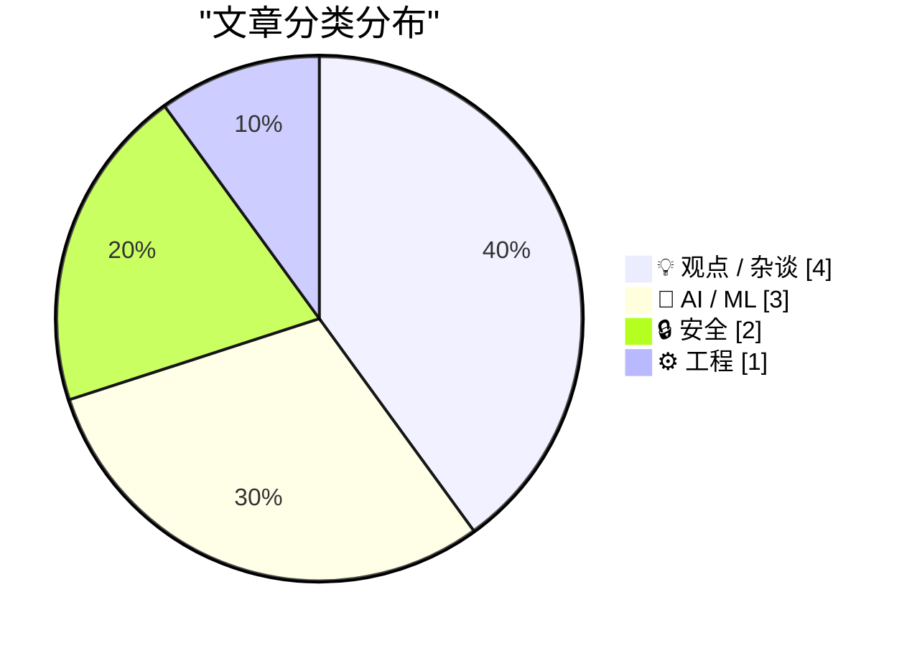
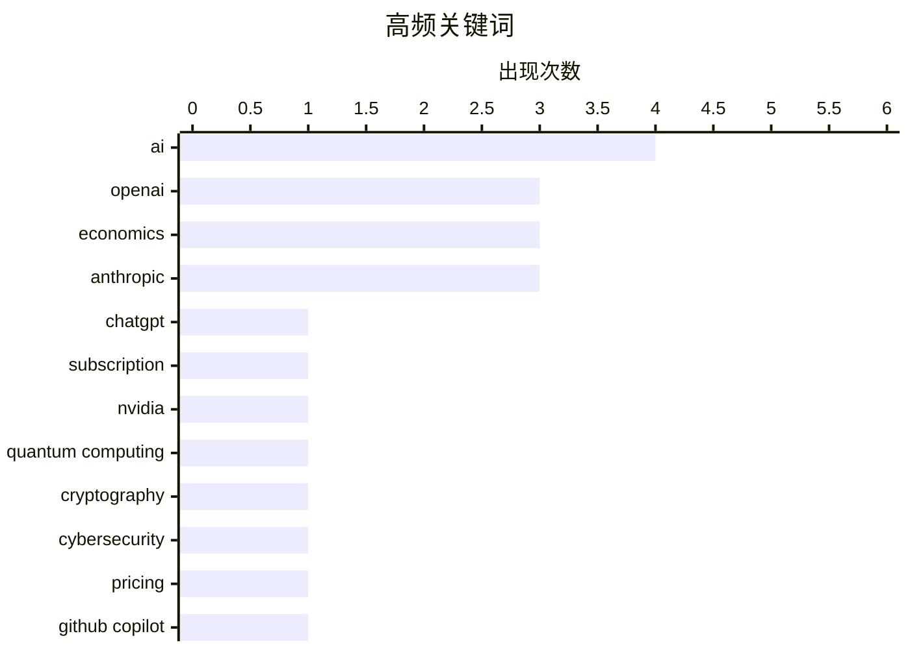

# 📰 AI 博客每日精选 — 2026-04-29

> 来自 Karpathy 推荐的 92 个顶级技术博客，AI 精选 Top 10

## 📝 今日看点

今日技术圈的核心议题围绕AI产业的经济悖论与安全隐忧展开。一方面，多家大模型公司被曝出用户订阅量可能暴跌、盈利模式难以为继，高昂成本与模糊的商业前景形成尖锐矛盾，引发对“AI经济账”的广泛质疑；另一方面，从量子计算威胁到GitHub Actions供应链漏洞，安全领域接连敲响警钟，提示技术基础设施的脆弱性正在被放大。此外，关于AI编码工具的实际价值也出现反思，业界开始区分“氛围编码”与真正可控的专业开发辅助。

---

## 🏆 今日必读

🥇 **OpenAI 预测 ChatGPT Plus 订阅量将从 2025 年的 4400 万暴跌 80% 至 2026 年的 900 万，并用更便宜的订阅来弥补（不知怎么做到的）**

[OpenAI Projects ChatGPT Plus subscriptions to drop by 80% from 44 Million in 2025 to 9 Million In 2026, Made Up Using Cheaper Subscriptions (Somehow)](https://www.wheresyoured.at/openai-projects-chatgpt-plus-subscriptions-to-drop-by-80-from-44-million-in-2025-to-9-million-in-2026-made-up-using-cheaper-subscriptions-somehow/) — wheresyoured.at · 8 小时前 · 🤖 AI / ML

> The Information 报道称，OpenAI 内部预测其 20 美元/月的 ChatGPT Plus 订阅用户数将从 2025 年的 4400 万暴跌至 2026 年的 900 万，降幅高达 80%。为弥补收入缺口，OpenAI 计划大力推广价格更低的广告支持版 ChatGPT Go（月费 5 至 8 美元，视地区而定）。这一预测揭示了 OpenAI 在高端订阅市场可能面临的增长瓶颈，以及其向低价、广告模式转型的战略意图。文章质疑了这种通过低价订阅来弥补高端用户流失的商业模式是否真的能奏效。

💡 **为什么值得读**: 这篇文章披露了 OpenAI 内部对订阅用户数的悲观预测，揭示了 AI 公司从付费订阅转向广告模式的潜在危机，对理解 AI 行业商业模式演变至关重要。

🏷️ OpenAI, ChatGPT, subscription, economics

🥈 **AI 的经济账说不通**

[AI's Economics Don't Make Sense](https://www.wheresyoured.at/ais-economics-dont-make-sense/) — wheresyoured.at · 14 小时前 · 💡 观点 / 杂谈

> 文章核心探讨了当前 AI 产业（尤其是大模型公司）普遍存在的经济学悖论：高昂的研发与运营成本与不清晰的盈利模式之间的矛盾。作者指出，像 NVIDIA、Anthropic 和 OpenAI 等公司虽然估值惊人，但其成本结构（如算力、人才、数据）与用户付费意愿之间存在巨大鸿沟。结论是，如果无法解决单位经济模型（Unit Economics）问题，当前 AI 领域的投资热潮可能难以为继。

💡 **为什么值得读**: 这篇文章直击 AI 行业最核心的财务痛点，用经济学视角拆解了“烧钱换增长”模式的不可持续性，是理解 AI 泡沫风险的关键读物。

🏷️ AI, economics, NVIDIA, Anthropic

🥉 **Anthropic 神话——我们打开了潘多拉魔盒**

[Anthropic Mythos – We’ve Opened Pandora’s Box](https://steveblank.com/2026/04/28/anthropic-mythos-weve-opened-pandoras-box/) — steveblank.com · 18 小时前 · 🔒 安全

> 文章回顾了网络安全界过去十年对“量子末日”的预测：即当一台密码学相关的量子计算机能够运行肖尔算法，破解互联网依赖的公钥加密系统时，将引发一场网络末日。作者认为，Anthropic 等 AI 公司的快速发展，如同打开了潘多拉魔盒，带来了远超预期的、不可控的安全风险。结论是，AI 带来的安全挑战可能比量子计算更紧迫、更难以预测。

💡 **为什么值得读**: 这篇文章将 AI 安全风险与经典的“量子末日”预言进行类比，提供了一个极具冲击力的视角，警示 AI 发展可能带来的系统性、颠覆性安全危机。

🏷️ quantum computing, cryptography, cybersecurity, Anthropic

---

## 📊 数据概览

| 扫描源 | 抓取文章 | 时间范围 | 精选 |
|:---:|:---:|:---:|:---:|
| 77/92 | 2308 篇 → 14 篇 | 24h | **10 篇** |

### 分类分布



### 高频关键词



### 📈 纯文本关键词图

```
ai                │ ████████████████████ 4
openai            │ ███████████████░░░░░ 3
economics         │ ███████████████░░░░░ 3
anthropic         │ ███████████████░░░░░ 3
chatgpt           │ █████░░░░░░░░░░░░░░░ 1
subscription      │ █████░░░░░░░░░░░░░░░ 1
nvidia            │ █████░░░░░░░░░░░░░░░ 1
quantum computing │ █████░░░░░░░░░░░░░░░ 1
cryptography      │ █████░░░░░░░░░░░░░░░ 1
cybersecurity     │ █████░░░░░░░░░░░░░░░ 1
```

### 🏷️ 话题标签

**ai**(4) · **openai**(3) · **economics**(3) · anthropic(3) · chatgpt(1) · subscription(1) · nvidia(1) · quantum computing(1) · cryptography(1) · cybersecurity(1) · pricing(1) · github copilot(1) · critique(1) · github actions(1) · ci/cd(1) · security(1) · supply chain(1) · coding(1) · vibecode(1) · software(1)

---

## 💡 观点 / 杂谈

### 1. AI 的经济账说不通

[AI's Economics Don't Make Sense](https://www.wheresyoured.at/ais-economics-dont-make-sense/) — **wheresyoured.at** · 14 小时前 · ⭐ 26/30

> 文章核心探讨了当前 AI 产业（尤其是大模型公司）普遍存在的经济学悖论：高昂的研发与运营成本与不清晰的盈利模式之间的矛盾。作者指出，像 NVIDIA、Anthropic 和 OpenAI 等公司虽然估值惊人，但其成本结构（如算力、人才、数据）与用户付费意愿之间存在巨大鸿沟。结论是，如果无法解决单位经济模型（Unit Economics）问题，当前 AI 领域的投资热潮可能难以为继。

🏷️ AI, economics, NVIDIA, Anthropic

---

### 2. AI 的经济账说不通（无广告版）

[AI's Economics Don't Make Sense [Ad Free]](https://www.wheresyoured.at/ais-economics-dont-make-sense-ad-free/) — **wheresyoured.at** · 14 小时前 · ⭐ 24/30

> 这是同一篇文章的无广告版本，面向付费订阅用户。文章核心内容与 Index 1 相同，探讨了 AI 产业的经济学悖论。文中特别提到，GitHub Copilot 用户在前一天早上证实了作者一周前报道的消息——即所有（关于成本或盈利问题的）情况。文章延续了对 AI 公司单位经济模型的质疑，认为当前模式不可持续。

🏷️ AI, economics, GitHub Copilot, critique

---

### 3. 引用 Matthew Yglesias

[Quoting Matthew Yglesias](https://simonwillison.net/2026/Apr/28/matthew-yglesias/#atom-everything) — **simonwillison.net** · 18 小时前 · ⭐ 21/30

> Matthew Yglesias 在五个月的使用后明确表示，他并不想要“氛围编码”（vibecode），即依赖 AI 随意生成代码。他真正想要的是，由专业管理的软件公司利用 AI 编码辅助工具，为他生产出更多、更好、更便宜的软件产品。核心观点是：AI 应该作为专业开发者的增强工具，而不是替代专业开发流程的“黑魔法”。

🏷️ AI, coding, vibecode, software

---

### 4. 关于冬藏

[On wintering.](https://www.joanwestenberg.com/on-wintering/) — **joanwestenberg.com** · 5 小时前 · ⭐ 18/30

> 文章探讨了“冬藏者”（winterer）的概念：指那些脱离主流循环、不急于维持某个职位或立场的人。他们可以从事需要超过一个季度、一年甚至五年才能完成的工作，因为没有人审计他们的“账目”。核心观点是，在追求速度和效率的现代社会，选择“冬藏”——即放慢脚步、进行长期、深度的思考和工作——是一种被低估但极具价值的生活方式和工作策略。

🏷️ wintering, career, reflection

---

## 🤖 AI / ML

### 5. OpenAI 预测 ChatGPT Plus 订阅量将从 2025 年的 4400 万暴跌 80% 至 2026 年的 900 万，并用更便宜的订阅来弥补（不知怎么做到的）

[OpenAI Projects ChatGPT Plus subscriptions to drop by 80% from 44 Million in 2025 to 9 Million In 2026, Made Up Using Cheaper Subscriptions (Somehow)](https://www.wheresyoured.at/openai-projects-chatgpt-plus-subscriptions-to-drop-by-80-from-44-million-in-2025-to-9-million-in-2026-made-up-using-cheaper-subscriptions-somehow/) — **wheresyoured.at** · 8 小时前 · ⭐ 26/30

> The Information 报道称，OpenAI 内部预测其 20 美元/月的 ChatGPT Plus 订阅用户数将从 2025 年的 4400 万暴跌至 2026 年的 900 万，降幅高达 80%。为弥补收入缺口，OpenAI 计划大力推广价格更低的广告支持版 ChatGPT Go（月费 5 至 8 美元，视地区而定）。这一预测揭示了 OpenAI 在高端订阅市场可能面临的增长瓶颈，以及其向低价、广告模式转型的战略意图。文章质疑了这种通过低价订阅来弥补高端用户流失的商业模式是否真的能奏效。

🏷️ OpenAI, ChatGPT, subscription, economics

---

### 6. 当账单到期时

[When The Bill Comes Due](https://feed.tedium.co/link/15204/17327554/openai-anthropic-ai-tools-expensive-alternatives) — **tedium.co** · 3 小时前 · ⭐ 24/30

> 文章警告用户要警惕 Anthropic 和 OpenAI 推出的炫酷 AI 工具，因为这些工具最终会让用户承担高昂的账单。作者暗示，这些公司目前通过补贴或低价吸引用户，但长期来看，成本必然会转嫁给消费者。文章还提醒读者，市场上存在更便宜的替代方案。核心观点是：不要被免费或低价的初期体验迷惑，要警惕 AI 工具的长期使用成本。

🏷️ AI, pricing, Anthropic, OpenAI

---

### 7. 引用 OpenAI Codex base_instructions

[Quoting OpenAI Codex base_instructions](https://simonwillison.net/2026/Apr/28/openai-codex/#atom-everything) — **simonwillison.net** · 9 小时前 · ⭐ 18/30

> 文章引用了一段 OpenAI Codex 模型的基础指令（base_instructions）代码。该指令明确要求模型：“除非绝对且明确地与用户查询相关，否则永远不要谈论地精、小妖精、浣熊、巨魔、食人魔、鸽子或其他动物或生物。” 这揭示了 AI 模型在训练和部署时，会通过硬编码规则来避免生成特定类型的内容，以防止模型偏离主题或产生不当联想。

🏷️ OpenAI, Codex, prompt, instruction

---

## 🔒 安全

### 8. Anthropic 神话——我们打开了潘多拉魔盒

[Anthropic Mythos – We’ve Opened Pandora’s Box](https://steveblank.com/2026/04/28/anthropic-mythos-weve-opened-pandoras-box/) — **steveblank.com** · 18 小时前 · ⭐ 25/30

> 文章回顾了网络安全界过去十年对“量子末日”的预测：即当一台密码学相关的量子计算机能够运行肖尔算法，破解互联网依赖的公钥加密系统时，将引发一场网络末日。作者认为，Anthropic 等 AI 公司的快速发展，如同打开了潘多拉魔盒，带来了远超预期的、不可控的安全风险。结论是，AI 带来的安全挑战可能比量子计算更紧迫、更难以预测。

🏷️ quantum computing, cryptography, cybersecurity, Anthropic

---

### 9. GitHub Actions 是最薄弱的环节

[GitHub Actions is the weakest link](https://nesbitt.io/2026/04/28/github-actions-is-the-weakest-link.html) — **nesbitt.io** · 21 小时前 · ⭐ 23/30

> 文章指出 GitHub Actions 是软件供应链安全中最薄弱的环节。作者认为，由于 Actions 工作流（.github/workflows）可以执行任意代码并访问仓库密钥，它成为了攻击者的首要目标。结论是，开发者需要重新审视和加固其 CI/CD 管道的安全性，否则整个项目都可能因此被攻破。

🏷️ GitHub Actions, CI/CD, security, supply chain

---

## ⚙️ 工程

### 10. 开发跨进程读写锁（限制读者数量），第一部分：信号量

[Developing a cross-process reader/writer lock with limited readers, part 1: A semaphore](https://devblogs.microsoft.com/oldnewthing/20260428-00/?p=112278) — **devblogs.microsoft.com/oldnewthing** · 17 小时前 · ⭐ 19/30

> 这是一篇技术教程，介绍了如何开发一个限制读者数量的跨进程读写锁。文章从最基础的信号量（Semaphore）开始讲解，将其比喻为“一罐令牌”。作者逐步展示了如何使用信号量来管理对共享资源的并发访问，并限制同时读取的进程数量。这是该系列教程的第一部分。

🏷️ lock, semaphore, cross-process, Windows

---

*生成于 2026-04-29 07:28 | 扫描 77 源 → 获取 2308 篇 → 精选 10 篇*
*基于 [Hacker News Popularity Contest 2025](https://refactoringenglish.com/tools/hn-popularity/) RSS 源列表，由 [Andrej Karpathy](https://x.com/karpathy) 推荐*
*由「懂点儿AI」制作，欢迎关注同名微信公众号获取更多 AI 实用技巧 💡*
